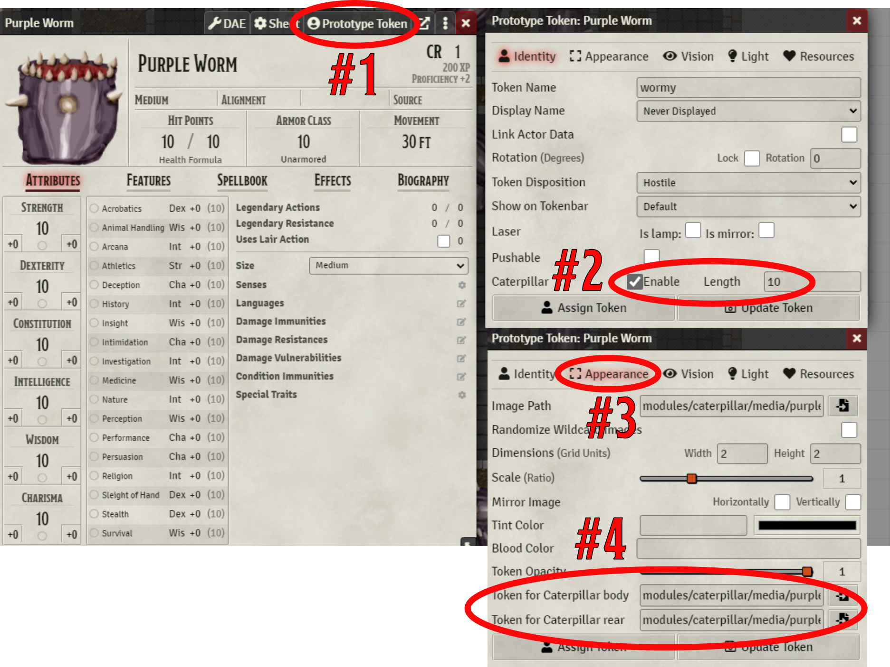

# caterpillar
Foundry module for creating snakes, looong monsters,(or even players?) . Modify a token, drag it onto the canvas and it automatically creates a head and many body segments. Move its head and the body follows.

Create your "head" actor, edit its prototype token #1 and enable “caterpillar”, and set a length (in number of segments) #2.
Change over to the appearance tab (#3), and select images for the body and rear tokens (#4). 

Drag your actor onto the scene, and it will automatically generate all the tail tokens.

## Demonstration:

If you like what i do feel free to support me at https://www.patreon.com/drO_o

Do you like to show off your creations, or ask questions about the module feel free to drop in at my discord channel: https://discord.gg/5CCAhsKFDp

